# schelling-model
Python Implementation of Schelling segregation Model

Based on: https://www.binpress.com/simulating-segregation-with-python/

## Examples

N | Tolerance | Initial | Final
--- | --- | --- | ---
1 | 30% | 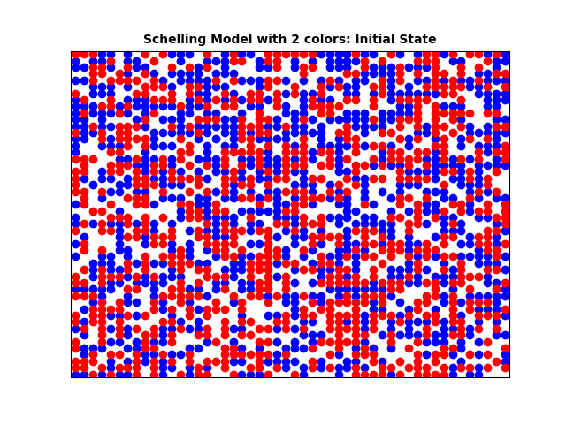 | 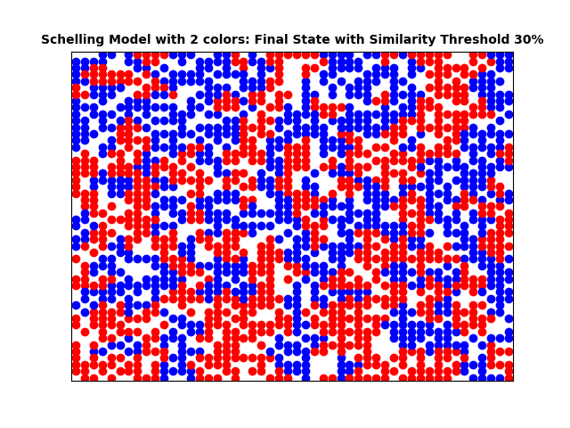
2 | 50% | 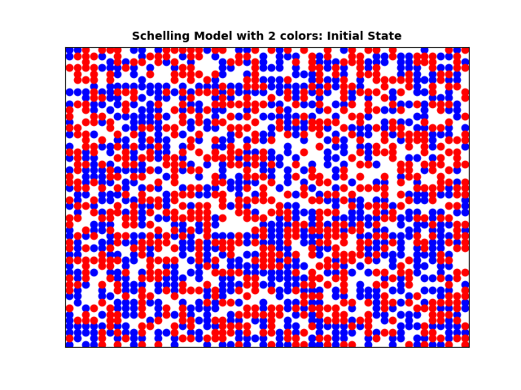 | 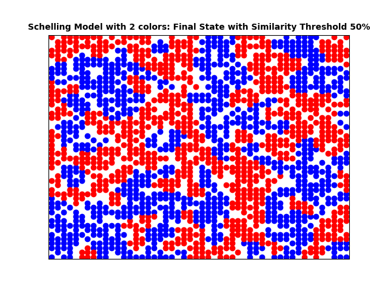
3 | 80% | 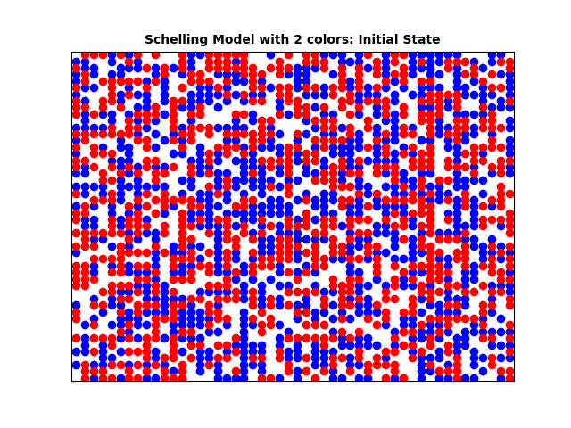 | 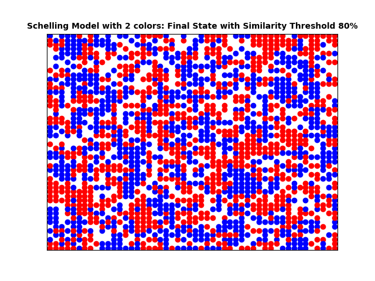
4 | 30% | 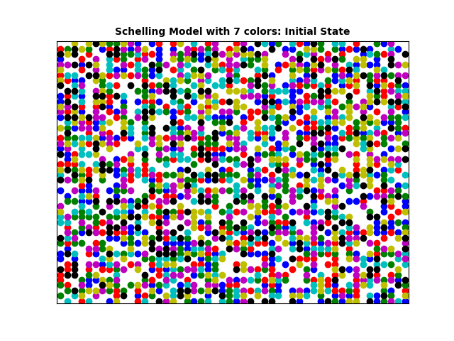 | 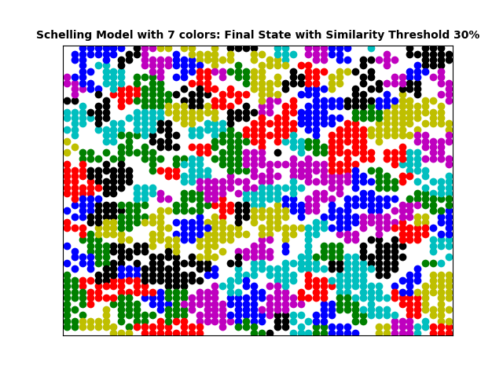
5 | 30% | 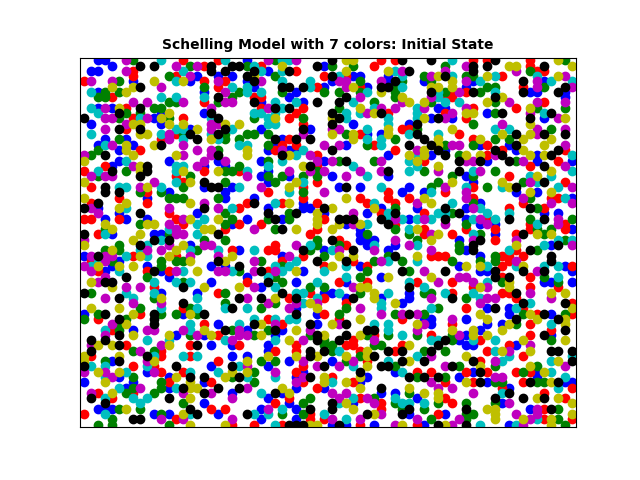 | 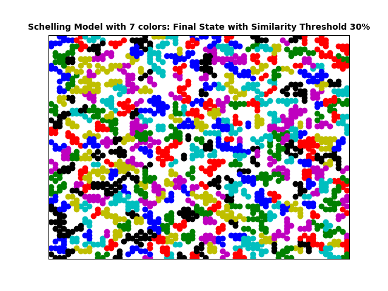
6 | 30% | 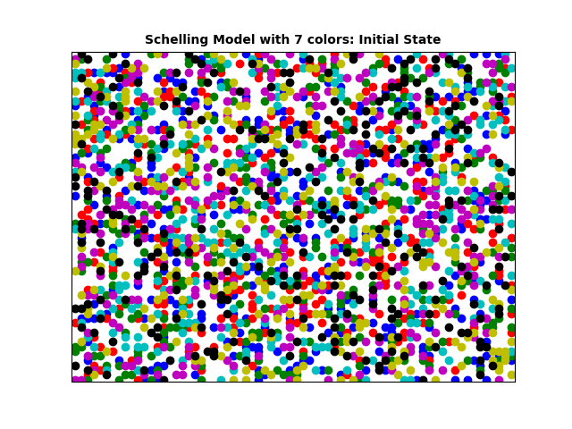 | 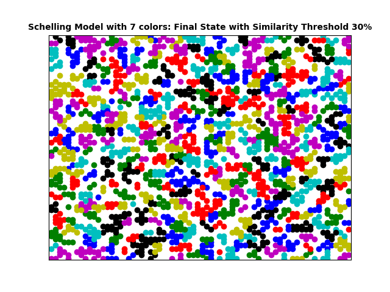

Parameters:
- In simulations 1, 2 and 3, we have a 50x50 grid with 2 races, 70% occupancy. In simulation 3, we did not reach convergence yet after 100 iterations.
- In simulation 4, we have a 50x50 grid with 7 races, 70% occupancy.
- In simulations 5 and 6, we have a 70x70 grid with 7 races, 40% occupancy. In simulation 5, an agent with no neighbors at all is considered unhappy, in simulation 6 they are considered happy.
